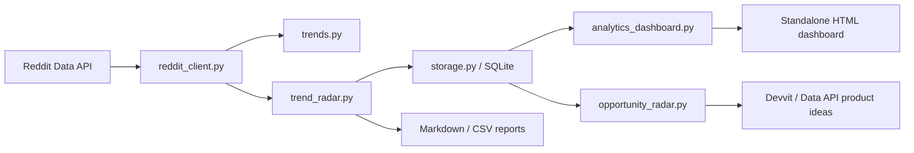

# ReddTrender Mimari Dokümantasyon İndeksi

Bu klasör, ReddTrender reposunda bulunan mevcut bileşenlerin ve ReddTrender verisinden çıkarılabilecek Reddit/Devvit ürün fikirlerinin nasıl çalıştığını anlatır.

## Dokümanlar

| Dosya | Kapsam |
|-------|--------|
| [reddtrender-cli.md](reddtrender-cli.md) | Data API tabanlı CLI akışı, OAuth2, komutlar ve modül sınırları. |
| [trend-radar-and-dashboard.md](trend-radar-and-dashboard.md) | Snapshot toplama, SQLite şeması, momentum hesabı, rapor ve HTML dashboard mimarisi. |
| [opportunity-radar.md](opportunity-radar.md) | Snapshot verisinden uygulama fikri skorlama, kategori modeli ve export akışı. |
| [devvit-product-blueprints.md](devvit-product-blueprints.md) | Para kazanma hedefli Devvit/Data API ürün blueprintleri: AI mod tool, oyun, analytics, backup vb. |
| [source-references.md](source-references.md) | Kullanılan resmi Reddit/Devvit kaynakları ve her kaynağın hangi karar için referans alındığı. |

## Üst Seviye Mimari

## İki Ayrı Geliştirme Kanalı

ReddTrender iki kanalı bilinçli biçimde ayırır:

| Kanal | Ne İçin Kullanılır | Repo İçindeki Karşılığı |
|------|---------------------|--------------------------|
| Data API / OAuth2 | Cross-subreddit okuma, lokal trend analizi, snapshot ve rapor üretimi. | Python CLI, `RedditClient`, `TrendRadarService`, SQLite store. |
| Devvit | Reddit içinde çalışan oyunlar, mod araçları, custom post/webview ve monetization. | Şimdilik dokümante edilmiş ürün blueprintleri; ayrı TypeScript/Devvit app olarak geliştirilmeli. |

## Ana Karar

ReddTrender'ı Devvit'e taşımak yerine, ReddTrender'ı trend ve fırsat keşif motoru olarak tutmak daha doğru. Devvit ürünleri bu motordan çıkan fırsatlara göre ayrı app olarak tasarlanmalı.

## Güvenlik Notu

- Reddit credential, client secret, password veya token değerleri dokümana, loga ya da rapora yazılmamalıdır.
- `.env` git dışında kalır; gerçek credential sadece lokal geliştirme ortamında tutulmalıdır.
- Reddit data ticari üründe kullanılacaksa Reddit'in Developer Terms, Data API Terms, Responsible Builder Policy ve gerekli yazılı onay koşulları ayrıca değerlendirilmelidir.
