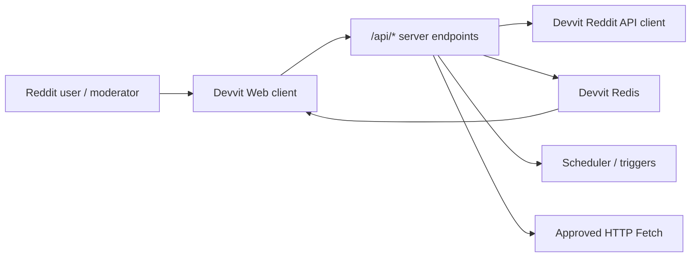

# Reddit ve Devvit Ürün Blueprintleri

Bu doküman, ReddTrender Opportunity Radar kategorilerini gerçek ürün projelerine çevirir. Her proje için kullanıcı, çalışma mantığı, önerilen mimari, veri modeli, monetization yolu ve kaynak referansları listelenir.

## Ortak Devvit Mimari Şablonu

Ortak prensipler:

- `devvit.json` app config, permissions, triggers, scheduler, menu ve payments tanımlarını taşır.
- Client sadece kendi `/api/*` endpointlerini çağırır.
- Reddit API erişimi için Devvit içinde `reddit` permission kullanılır.
- Redis installation bazlıdır; cross-community global veri istenirse approved external backend gerekir.
- External AI veya SaaS çağrıları HTTP Fetch allowlist, Terms ve Privacy Policy gerektirir.

## 1. AI Content Moderation

### Problem

Moderasyon ekipleri AI-generated, düşük emekli, spammy veya bot benzeri içerikleri manuel ayıklamakta zorlanır.

### Nasıl Çalışır

1. `onPostCreate` ve `onCommentCreate` triggerları yeni içerikleri alır.
2. Server, metin/flaire göre lokal kurallarla hızlı risk skoru üretir.
3. Gerekirse approved AI provider ile açıklamalı sınıflandırma yapılır.
4. Risk ve gerekçe Redis'e yazılır.
5. Moderator menu veya dashboard, queue item'ları skor/gerekçe ile gösterir.
6. Mod aksiyonları feedback olarak saklanır ve eşik ayarı için kullanılır.

### Önerilen Mimari

| Katman | Sorumluluk |
|--------|------------|
| Devvit triggers | Yeni post/comment yakalama. |
| Server endpoint | Risk skoru, açıklama ve feedback işleme. |
| Redis hashes | Per-content risk state ve mod feedback. |
| Redis sorted set | Risk sırasına göre queue index. |
| HTTP Fetch | Sadece gerekirse OpenAI/Gemini sınıflandırması. |
| Webview | Moderator dashboard ve threshold ayarları. |

### MVP

- Text-only post/comment scoring.
- 3 risk seviyesi: low, review, high.
- Mod dashboard: title, author, reason, score, action buttons.
- False positive/false negative feedback.

### Monetization

- Developer Funds: install ve moderator engagement hedefi.
- Premium community pack: custom thresholds, advanced reports, export.
- AI cost varsa usage cap veya paid feature gerekir.

### Policy Notları

- Kullanıcıları hassas özelliklere göre profilleme yapılmamalıdır.
- İçerik silinirse app storage'daki kopya da temizlenmelidir.
- AI provider kullanımı README, Terms ve Privacy Policy içinde açıkça anlatılmalıdır.

### Referanslar

- Triggers/Scheduler: https://developers.reddit.com/docs/capabilities/server/scheduler
- HTTP Fetch: https://developers.reddit.com/docs/capabilities/http-fetch
- Devvit Rules: https://developers.reddit.com/docs/devvit_rules

## 2. Mod Queue Operations

### Problem

Mod queue'da önceliklendirme, aksiyon geçmişi ve ekip koordinasyonu zayıftır. Birden fazla mod aynı item üzerinde çalışabilir, aksiyon sonrası bağlam kaybolabilir.

### Nasıl Çalışır

1. Report/modqueue sinyalleri trigger veya Reddit API client ile okunur.
2. Queue item'ları risk, report reason, user context ve age'e göre sıralanır.
3. Bir mod item açtığında Redis'te soft lock veya presence bilgisi tutulur.
4. Aksiyon sonucu, reason ve timestamp audit entry olarak saklanır.
5. Dashboard, "kim neye bakıyor" ve "hangi item önce" sorularını cevaplar.

### Önerilen Mimari

| Katman | Sorumluluk |
|--------|------------|
| Devvit Reddit API | Post/comment ve mod action context. |
| Redis sorted set | Prioritized queue. |
| Redis hashes | Item detail, lock, action history. |
| Webview | Moderator cockpit. |
| Menu actions | Post/comment üstünden hızlı aksiyon. |

### MVP

- Queue priority list.
- Soft lock / active moderator indicator.
- Action history retained after item disappears from native queue.
- Suggested removal reason templates.

### Monetization

- Developer Funds için broad mod utility olarak App Directory hedeflenir.
- Premium: longer audit retention, cross-team exports, advanced templates.

### Policy Notları

- Moderator data access sadece moderation amacıyla kullanılmalıdır.
- Cross-subreddit user risk profili yapılacaksa privacy ve approval riski yüksektir; MVP'de tek subreddit sınırında kalmak daha güvenlidir.

### Referanslar

- Devvit Reddit API: https://developers.reddit.com/docs/capabilities/server/reddit-api
- Redis: https://developers.reddit.com/docs/capabilities/server/redis
- Launch guide: https://developers.reddit.com/docs/guides/launch/launch-guide

## 3. Subreddit Analytics

### Problem

Modlar ve community yöneticileri hangi konuların büyüdüğünü, hangi saatlerin iyi çalıştığını ve topluluk sağlığını uygun maliyetle görmek ister.

### Nasıl Çalışır

1. Scheduler günlük/haftalık job çalıştırır.
2. Devvit Reddit API ile kurulu subreddit içindeki post/comment metrikleri alınır.
3. Redis'te günlük aggregate tutulur.
4. Webview dashboard trend, heat, keyword ve top content bölümlerini gösterir.
5. Opsiyonel: ReddTrender Data API tarafı cross-subreddit research için ayrı çalışır.

### Önerilen Mimari

| Katman | Sorumluluk |
|--------|------------|
| Scheduler | Günlük/haftalık aggregate job. |
| Redis hashes | Daily metrics. |
| Redis sorted sets | Top posts, active topics. |
| Webview | Analytics dashboard. |
| ReddTrender Python | Cross-subreddit lokal research ve market intelligence. |

### MVP

- Son 7/30 gün post/comment heat.
- Top post listesi.
- Keyword movement.
- Best posting window tahmini.
- Weekly moderator summary.

### Monetization

- Tek-community Devvit dashboard: Developer Funds.
- Cross-community analytics veya SaaS: Reddit'ten yazılı commercial approval gerektirebilir.

### Policy Notları

- Tek subreddit içi aggregate daha düşük risklidir.
- Public content attribution ve link-back korunmalıdır.
- External SaaS modelinde privacy policy ve data retention açık olmalıdır.

### Referanslar

- Scheduler: https://developers.reddit.com/docs/capabilities/server/scheduler
- Redis storage: https://developers.reddit.com/docs/capabilities/server/redis
- Responsible Builder Policy: https://support.reddithelp.com/hc/en-us/articles/42728983564564-Responsible-Builder-Policy

## 4. Daily Community Games

### Problem

Subredditler günlük etkileşim, tekrar ziyaret ve sosyal rekabet yaratacak düşük sürtünmeli deneyimler ister.

### Nasıl Çalışır

1. App custom post/webview olarak oyun ekranı oluşturur.
2. Kullanıcı her gün quiz, tahmin, puzzle veya mini challenge oynar.
3. Score/streak Redis'te saklanır.
4. Leaderboard ve flair reward community içinde görünür.
5. Scheduler günlük yeni round açar.
6. Payments ile ek can, kozmetik veya premium challenge satılabilir.

### Önerilen Mimari

| Katman | Sorumluluk |
|--------|------------|
| Devvit Web client | Oyun UI ve etkileşim. |
| Server endpoints | Cevap doğrulama, score update, reward. |
| Redis sorted set | Leaderboard. |
| Redis hashes | User streak, daily state. |
| Scheduler | Daily reset / new question. |
| Payments | Optional premium items. |

### MVP

- Daily trivia veya prediction.
- One play per user per day.
- Streak and leaderboard.
- Shareable result comment veya post update.

### Monetization

- Developer Funds en doğal kanal: engagement hedeflidir.
- In-App Purchases: cosmetic flair, extra life, premium game mode.

### Policy Notları

- Pay-to-win hissi yaratmamak için paid ürünler dikkatli tasarlanmalıdır.
- Oyun SFW communities ve monetization eligible içeriklerde hedeflenmelidir.

### Referanslar

- Devvit Web: https://developers.reddit.com/docs/capabilities/devvit-web/devvit_web_overview
- Payments: https://developers.reddit.com/docs/earn-money/payments/payments_overview
- Developer Funds: https://support.reddithelp.com/hc/en-us/articles/27958169342996-Reddit-Developer-Funds-H1-2026-Terms

## 5. Accessibility and Summaries

### Problem

Uzun threadler, görsel açıklaması eksik postlar ve çok dilli topluluklar erişilebilirlik ve özet ihtiyacı doğurur.

### Nasıl Çalışır

1. Menu action veya trigger ile post/comment thread seçilir.
2. Server public content'i alır.
3. Kısa özet, alt text reminder veya çeviri önerisi üretilir.
4. Sonuç mod onayıyla comment, custom post veya dashboard içinde sunulur.

### Önerilen Mimari

| Katman | Sorumluluk |
|--------|------------|
| Menu actions | Moderator/user initiated summary. |
| Reddit API | Thread/post content read. |
| HTTP Fetch | Approved AI summary/translation provider. |
| Redis | Request/result cache and consent state. |
| Webview | Review screen. |

### MVP

- Long-post TL;DR generator.
- Image post alt-text reminder.
- Moderator-reviewed summary before posting.

### Monetization

- Developer Funds if it improves engagement and community utility.
- Premium: higher monthly summary quota or multilingual pack.

### Policy Notları

- AI output otomatik yayınlanmadan önce review önerilir.
- User content attribution korunmalıdır.
- External AI fetch açıkça dokümante edilmeli ve privacy policy bulunmalıdır.

### Referanslar

- HTTP Fetch: https://developers.reddit.com/docs/capabilities/http-fetch
- Devvit Rules: https://developers.reddit.com/docs/devvit_rules
- Developer Terms: https://redditinc.com/policies/developer-terms

## 6. Settings Backup

### Problem

Büyük subredditlerde AutoMod, wiki, flair ve rule ayarlarının yanlışlıkla veya kötü niyetli değişmesi operasyonel risk yaratır.

### Nasıl Çalışır

1. Scheduler günlük veya haftalık backup job çalıştırır.
2. App, erişebildiği mod/config kaynaklarını okur.
3. Snapshot Redis'e compressed JSON olarak yazılır.
4. Dashboard diff ve history gösterir.
5. Restore işlemi otomatik değilse bile uygulanacak değişiklikleri modlara açıkça gösterir.

### Önerilen Mimari

| Katman | Sorumluluk |
|--------|------------|
| Scheduler | Periodic backup. |
| Devvit Reddit API | Rules/wiki/flair/available mod settings access. |
| Redis compressed values | Snapshot storage. |
| Webview | Diff and restore guidance. |
| Mod menu | Manual backup now. |

### MVP

- Manual backup.
- Last 10 snapshots.
- Diff view.
- Download/copy restore instructions.

### Monetization

- Developer Funds through mod utility installs.
- Premium: longer retention, scheduled alerts, advanced diff.

### Policy Notları

- Restore operations should require explicit moderator confirmation.
- Sensitive mod-only content retention period must be documented.

### Referanslar

- Redis storage limits and patterns: https://developers.reddit.com/docs/capabilities/server/redis
- Launch guide: https://developers.reddit.com/docs/guides/launch/launch-guide
- Devvit Rules: https://developers.reddit.com/docs/devvit_rules

## 7. Reddit Market Research

### Problem

Indie builders ve SaaS ekipleri Reddit'te tekrar eden pain point, competitor mention ve ödeme sinyallerini görmek ister.

### Nasıl Çalışır

1. ReddTrender Data API tarafı public subredditlerde snapshot toplar.
2. Opportunity Radar market-research-local kategorisini skorlar.
3. Lokal dashboard pain point, keyword ve momentum kümelerini gösterir.
4. Commercial ürünleşme hedeflenirse Reddit'ten explicit written approval yolu değerlendirilir.

### Önerilen Mimari

| Katman | Sorumluluk |
|--------|------------|
| ReddTrender Python | Cross-subreddit data collection. |
| SQLite | Local snapshots. |
| Opportunity Radar | Pain point/product idea scoring. |
| Dashboard | Founder-facing reports. |
| Approved backend | Sadece yazılı onay sonrası multi-user SaaS. |

### MVP

- Local-only research workspace.
- Keyword watchlists.
- Pain point report export.
- No redistribution of raw Reddit data.

### Monetization

- Bu kategori en yüksek policy riski taşır.
- Subscription ancak Reddit data commercial use approval ile düşünülmelidir.
- Daha güvenli alternatif: tool'u kişisel/local research utility olarak tutmak.

### Policy Notları

- Reddit data satışı, license edilmesi, brokerlığı veya izinsiz commercialize edilmesi yasaktır.
- Reddit data AI model training için kullanılmamalıdır.
- Public content attribution ve link-back korunmalıdır.

### Referanslar

- Responsible Builder Policy: https://support.reddithelp.com/hc/en-us/articles/42728983564564-Responsible-Builder-Policy
- Developer Terms: https://redditinc.com/policies/developer-terms
- ReddTrender Opportunity Radar: [opportunity-radar.md](opportunity-radar.md)
