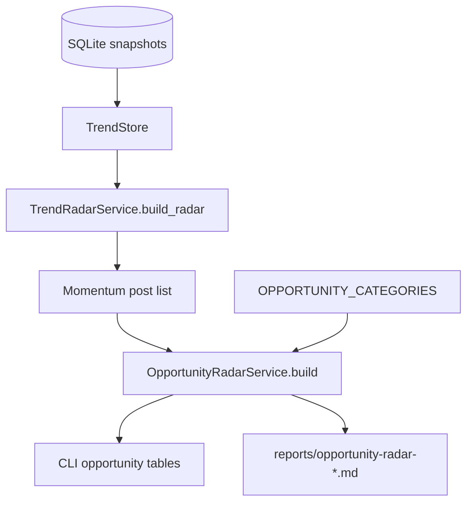

# Opportunity Radar Mimarisi

## Amaç

Opportunity Radar, ReddTrender snapshot verisini ürün fikri skorlama katmanına dönüştürür. Soru şudur:

> Bu trend verisinden hangi Reddit/Devvit uygulamasını geliştirmek ticari veya topluluk değeri açısından daha mantıklı?

Analiz deterministiktir; external AI servisi çağırmaz ve Reddit verisini dışarı göndermez.

## Veri Akışı



## Ana Dosya

| Dosya | Sorumluluk |
|------|------------|
| `opportunity_radar.py` | Kategori tanımları, keyword eşleşmesi, skor hesaplama, confidence ve Markdown export. |
| `main.py` | `--opportunities`, `--opportunity-category`, `--opportunity-export` CLI bağları. |
| `tests/test_opportunity_radar.py` | Gerçek Reddit'e gitmeden geçici SQLite snapshotlarıyla davranış testi. |

## Kategori Modeli

Her kategori şu alanları taşır:

```python
{
    "name": "Human readable name",
    "platform_fit": "Devvit mod tool / Data API dashboard / Hybrid",
    "target_user": "Kim kullanır",
    "monetization": "Developer Funds, IAP, subscription vb.",
    "mvp": "İlk ürün kapsamı",
    "keywords": ["ai", "spam", "modqueue"]
}
```

Mevcut kategoriler:

| Key | Ürün Fikri |
|-----|------------|
| `ai-content-moderation` | AI/slop/spam/modqueue tespiti. |
| `mod-queue-ops` | Moderatör operasyon katmanı. |
| `subreddit-analytics` | Subreddit heat, growth ve health dashboard. |
| `daily-community-games` | Trivia, prediction, streak, leaderboard tabanlı Devvit oyunları. |
| `accessibility-and-summary` | TL;DR, çeviri, alt text ve digest araçları. |
| `settings-backup` | AutoMod/wiki/flair/rule yedekleme ve kurtarma. |
| `market-research-local` | Public threadlerden pain point ve ürün fikri çıkarma. |

## Skorlama Adımları

1. Son veya seçilen snapshot okunur.
2. `TrendRadarService.build_radar()` ile momentum postları alınır.
3. Her kategori için title, selftext, subreddit ve flair alanlarında keyword eşleşmesi aranır.
4. Eşleşen postlara contribution skoru verilir.
5. Kategori skoru; en güçlü evidence postları, subreddit genişliği ve keyword çeşitliliği ile hesaplanır.
6. `high`, `medium`, `low` confidence atanır.

## Contribution Modeli

Basitleştirilmiş hesap:

```text
relevance = keyword_count bonus
activity = score + comments ağırlığı
velocity = momentum_score ağırlığı
novelty = yeni post bonusu
contribution = relevance + activity + velocity + novelty
```

Kategori toplamı:

```text
category_score = top_evidence_contribution + subreddit_breadth + keyword_breadth
```

Bu skor yatırım kararı değildir; hangi fikri önce prototiplemek gerektiğini sıralamak için bir sinyaldir.

## CLI Kullanımı

```bash
# Son snapshot üzerinden fırsatları skorla
python main.py --opportunities

# Snapshot al, sonra aynı çalışmada skorla
python main.py --snapshot --opportunities

# Tek kategoriye odaklan
python main.py --opportunities --opportunity-category daily-community-games

# Markdown rapor üret
python main.py --opportunities --opportunity-export markdown
```

## Output Yapısı

Terminal:

- Fırsat adı
- Skor
- Confidence
- Platform fit
- Monetization yaklaşımı
- Evidence post/subreddit sayısı
- İlk 3 fırsat için kanıt post tablosu

Markdown:

- Snapshot metadata
- Ranked opportunity tablosu
- Her fırsat için MVP, target user, matched keywords ve evidence linkleri

## Nasıl Genişletilir?

Yeni kategori eklemek için `OPPORTUNITY_CATEGORIES` içine yeni key eklenir:

```python
"example-category": {
    "name": "Example Product",
    "platform_fit": "Devvit utility",
    "target_user": "Moderators",
    "monetization": "Developer Funds",
    "mvp": "First useful workflow",
    "keywords": ["keyword one", "keyword two"],
}
```

Test önerisi:

- İlgili keywordleri içeren geçici snapshot yarat.
- `OpportunityRadarService.build()` sonucunda kategorinin listelendiğini doğrula.
- Markdown export içinde kategori adı ve evidence başlığını ara.

## Sınırlamalar

- Keyword tabanlıdır; semantic intent analizi yapmaz.
- Reddit data'yı dışarı göndermediği için güvenli ve hızlıdır, fakat daha sofistike analizler için NLP/AI katmanı gerekebilir.
- Commercial use kararı için Reddit policy ve yazılı onay gereksinimleri ayrıca değerlendirilmelidir.

## Referans Kaynaklar

- Devvit overview: https://developers.reddit.com/docs/
- Devvit payments: https://developers.reddit.com/docs/earn-money/payments/payments_overview
- Reddit Developer Funds H1 2026: https://support.reddithelp.com/hc/en-us/articles/27958169342996-Reddit-Developer-Funds-H1-2026-Terms
- Responsible Builder Policy: https://support.reddithelp.com/hc/en-us/articles/42728983564564-Responsible-Builder-Policy
