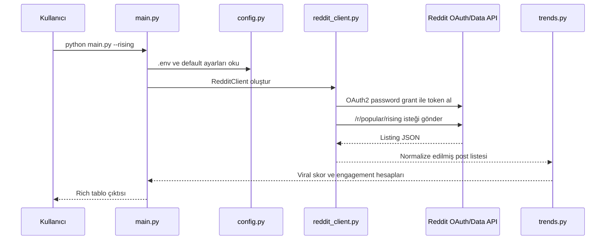

# ReddTrender CLI ve Data API Mimarisi

## Amaç

ReddTrender CLI, Reddit Data API üzerinden public post sinyallerini okur ve terminalde trend, arama, subreddit karşılaştırması, snapshot ve rapor çıktıları üretir. Bu bileşen kişisel ve lokal trend takibi için tasarlanmıştır.

## Çalışma Modeli



## Ana Dosyalar

| Dosya | Sorumluluk |
|------|------------|
| `main.py` | CLI argümanları, terminal tabloları ve feature routing. |
| `config.py` | `.env`, default subreddit/keyword, Data API URL ve output path ayarları. |
| `reddit_client.py` | OAuth2 token alma, rate-limit kontrolü, GET istekleri ve Reddit listing parse işlemi. |
| `trends.py` | Günlük özet, rising viral skor, subreddit heat hesabı ve kelime frekansı. |

## Kimlik Doğrulama

`RedditClient` script-app tarzı OAuth2 password grant akışıyla access token alır. Gerekli ortam değişkenleri:

```env
REDDIT_CLIENT_ID=
REDDIT_CLIENT_SECRET=
REDDIT_USERNAME=
REDDIT_PASSWORD=
REDDIT_USER_AGENT=
```

`REDDIT_USER_AGENT` uygulamayı açıkça tanımlamalıdır. Credential bilgileri yalnızca `.env` içinde kalmalı ve repo'ya commit edilmemelidir.

## Okunan Endpoint'ler

| CLI İşlevi | Endpoint |
|-----------|----------|
| Popular | `GET /r/popular` |
| Hot | `GET /r/{subreddit}/hot` |
| Rising | `GET /r/{subreddit}/rising` |
| Top | `GET /r/{subreddit}/top?t={time}` |
| Best | `GET /best` |
| Search | `GET /search` veya `GET /r/{subreddit}/search` |

## Veri Sözleşmesi

`reddit_client.py` her postu bu ortak şekle normalize eder:

```python
{
    "id": str,
    "title": str,
    "subreddit": "r/name",
    "author": str,
    "score": int,
    "upvote_ratio": float,
    "num_comments": int,
    "url": str,
    "created_utc": float,
    "selftext": str,
    "is_self": bool,
    "link_flair_text": str,
    "over_18": bool,
    "spoiler": bool,
    "stickied": bool,
}
```

Bu ortak sözleşme `trends.py`, `storage.py`, `trend_radar.py` ve `opportunity_radar.py` arasında paylaşılır.

## Komut Aileleri

| Komut | Ne Yapar |
|-------|----------|
| `python main.py` | Popular, rising ve top today verilerini birleştirip günlük özet gösterir. |
| `python main.py --hot` | `/r/popular` hot postlarını gösterir. |
| `python main.py --rising` | Rising postları viral skorla sıralar. |
| `python main.py --top --time week` | Belirli zaman aralığındaki top postları gösterir. |
| `python main.py --subreddits technology,programming` | Subreddit heat karşılaştırması yapar. |
| `python main.py --topics` | Popular title kelimelerinden sıcak konu listesi çıkarır. |
| `python main.py --search "query"` | Reddit search endpoint'ini kullanır. |

## Hata ve Limit Yönetimi

- Token süresi dolmaya yakınsa `RedditClient._ensure_token()` yeniden authenticate eder.
- `X-Ratelimit-Remaining` ve `X-Ratelimit-Reset` başlıkları okunur.
- 429 durumunda exponential backoff uygulanır.
- 401 durumunda token yenilenip istek tekrar denenir.

## Neden Devvit Değil?

Bu CLI cross-subreddit ve on-demand çalışır. Devvit ise Reddit içinde kurulu app bağlamında çalışan, kısa süreli server endpoint'leri ve installation bazlı state modeli olan bir platformdur. Bu nedenle ReddTrender CLI için Data API doğru katmandır; Devvit, bu analizden doğan ürünleri Reddit içinde dağıtmak için kullanılmalıdır.

## Referans Kaynaklar

- Reddit Responsible Builder Policy: https://support.reddithelp.com/hc/en-us/articles/42728983564564-Responsible-Builder-Policy
- Reddit Developer Terms: https://redditinc.com/policies/developer-terms
- Devvit Reddit API overview: https://developers.reddit.com/docs/capabilities/server/reddit-api
