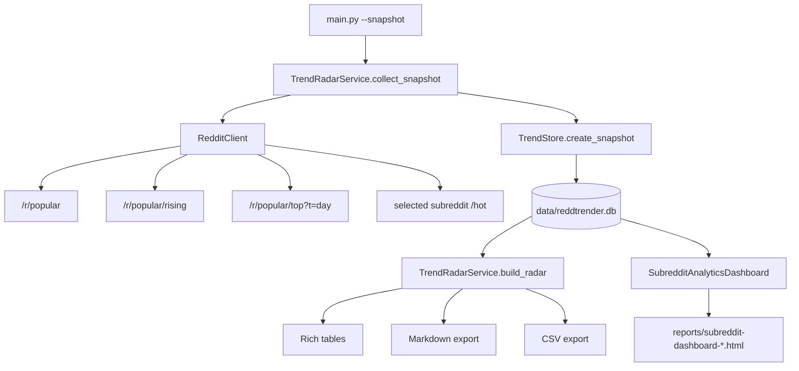

# Trend Radar ve Analytics Dashboard Mimarisi

## Amaç

Trend Radar, Reddit'ten alınan postları yerel SQLite veritabanına snapshot olarak kaydeder. Daha sonra yeni snapshot ile önceki snapshot karşılaştırılarak momentum, heat delta ve keyword alarmı hesaplanır.

Analytics Dashboard ise aynı lokal veriyi statik bir HTML dosyasına dönüştürür.

## Veri Akışı



## Ana Dosyalar

| Dosya | Sorumluluk |
|------|------------|
| `storage.py` | SQLite tablo oluşturma, snapshot/post/metric/alert kayıt ve okuma işlemleri. |
| `trend_radar.py` | Snapshot toplama, önceki snapshot ile karşılaştırma, momentum ve export. |
| `analytics_dashboard.py` | Snapshot geçmişinden KPI, tablo, SVG chart ve standalone HTML üretimi. |
| `main.py` | `--snapshot`, `--radar`, `--alerts`, `--history`, `--dashboard` komutlarını bağlar. |

## SQLite Şeması

| Tablo | İçerik |
|-------|--------|
| `snapshots` | Snapshot zamanı, etiket, kaynak ve post sayısı. |
| `posts` | Snapshot içindeki normalize post verileri. |
| `subreddit_metrics` | Subreddit bazlı total score, comment, avg score, heat ve top post. |
| `keyword_alerts` | Snapshot sırasında keyword eşleşmesi yapan postlar. |

## Snapshot Toplama

`TrendRadarService.collect_snapshot()` şu kaynakları birleştirir:

1. `client.get_popular(limit)`
2. `client.get_rising("popular", limit)`
3. `client.get_top("popular", time_filter="day", limit)`
4. Config veya CLI ile verilen subreddit listesi için `get_subreddit_posts(subreddit, sort="hot")`

Postlar `trend_category` alanıyla etiketlenir. Aynı post birden fazla kaynakta görünürse `TrendStore._dedupe_posts()` tek kayda indirir ve kategorileri birleştirir.

## Momentum Hesabı

`TrendRadarService._rank_posts()` iki durumu ayırır:

- **Takip edilen post:** Önceki snapshot'ta da vardır. Score/comment delta hesaplanır.
- **Yeni post:** Önceki snapshot'ta yoktur. Yaşına göre normalize edilir.

Basitleştirilmiş model:

```text
positive_activity = max(score_delta, 0) + max(comment_delta, 0) * 2
momentum_score = (positive_activity / elapsed_hours) * upvote_ratio
```

Yeni postlarda mevcut score ve comment değerleri kısmi bonus olarak hesaba katılır. Amaç, hem hızlanan eski postları hem de yeni patlayan postları yakalamaktır.

## Subreddit Heat Delta

`TrendStore.build_subreddit_metrics()` her subreddit için:

```text
heat_index = total_score * 0.5 + total_comments * 0.3 + post_count * 20
```

`TrendRadarService._compare_subreddits()` yeni heat ile önceki heat arasındaki farkı hesaplar.

## Export Çıktıları

| Komut | Çıktı |
|-------|------|
| `python main.py --radar --export markdown` | `reports/trend-radar-*.md` |
| `python main.py --radar --export csv` | `reports/trend-radar-*.csv` |
| `python main.py --dashboard` | `reports/subreddit-dashboard-*.html` |

## Dashboard Yapısı

`SubredditAnalyticsDashboard.build()` şu modeli üretir:

- `kpis`: post count, tracked subreddit count, total heat, keyword alert count.
- `top_subreddits`: heat delta sırasına göre subredditler.
- `heat_series`: snapshot geçmişinden SVG line chart verisi.
- `keyword_summary`: geçmiş snapshotlardaki keyword yoğunluğu.
- `latest_alerts`: son snapshot keyword alarm listesi.
- `top_posts`: Trend Radar momentum postları.
- `recommendations`: kısa operasyon notları.

HTML output tek dosyadır; web server gerektirmez.

## Operasyon Notları

- SQLite dosyası `REDDTRENDER_DB_PATH` veya varsayılan `data/reddtrender.db` konumunda tutulur.
- `data/` ve `reports/` git dışında bırakılır.
- Snapshotlar lokal olduğundan Reddit data dış servise gönderilmez.
- Windows'ta SQLite dosyasının kilitli kalmaması için `TrendStore._connect()` bağlantıyı her işlemden sonra kapatır.

## Referans Kaynaklar

- Reddit Responsible Builder Policy: https://support.reddithelp.com/hc/en-us/articles/42728983564564-Responsible-Builder-Policy
- Reddit Developer Terms: https://redditinc.com/policies/developer-terms
- Devvit Redis storage notları: https://developers.reddit.com/docs/capabilities/server/redis
